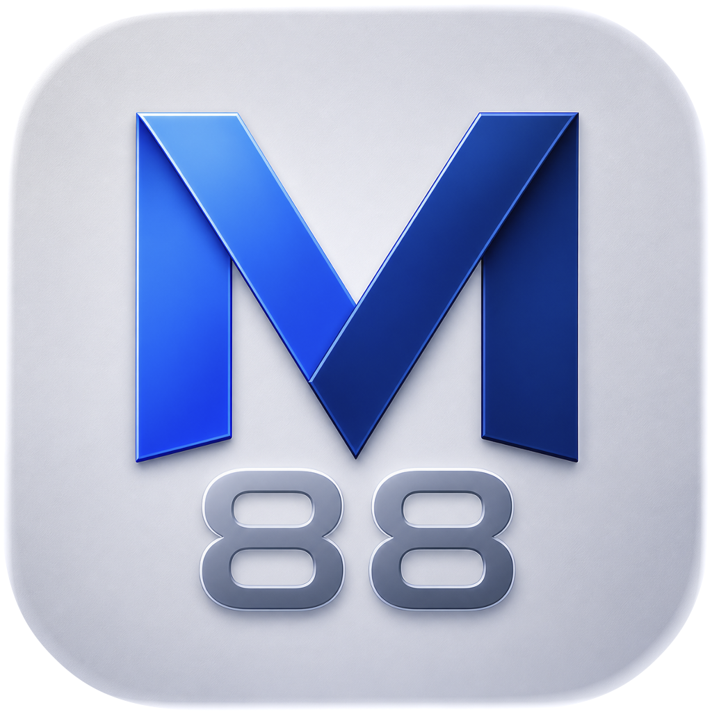
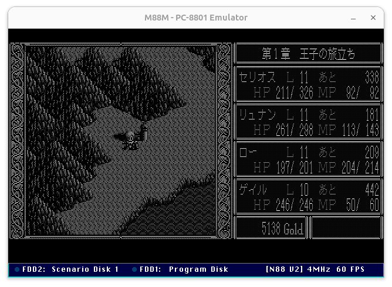
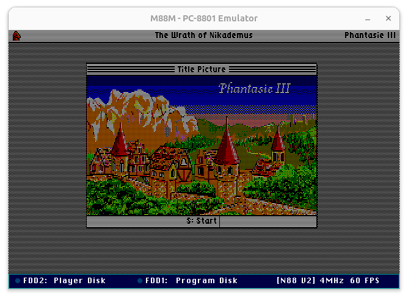
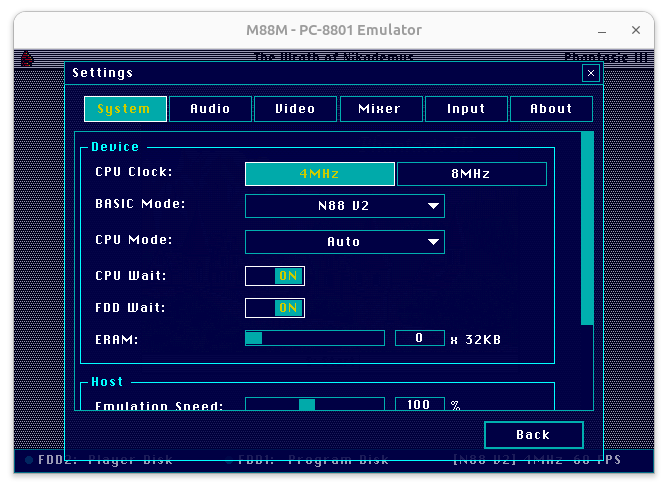

# M88M - PC-8801 Series Emulator

<p align="center">
  
</p>

M88M is a modern, cross-platform port of the classic PC-8801 emulator **M88**, originally developed by **cisc**.

<p align="center">
  <a href="https://github.com/bubio/M88M/releases/latest">
    
  </a>
  <a href="https://github.com/bubio/M88M/blob/main/LICENSE">
    
  </a>
  <a href="https://github.com/bubio/M88M/releases/latest">
    
  </a>
</p>

While the original M88 was tightly coupled with the Win32 API and DirectX, M88M leverages **raylib** and **raygui** for its frontend, making it natively compatible with **macOS (Intel/Apple Silicon)**, **Linux**, and **Windows** via a single CMake-based build system.

<p align="center"></p>
<p align="center"></p>
<p align="center"></p>

## Key Features

- **Cross-Platform:** Native support for macOS, Linux, and Windows.
- **Raylib Frontend:** Modern, lightweight hardware-accelerated rendering and audio.
- **Core Integrity:** Retains the highly accurate emulation core of the original M88 while replacing the platform-dependent layers.
- **Modern Build System:** Uses CMake for easy compilation with modern compilers (Clang, GCC, MSVC).
- **Dual-Threaded Architecture:** Separate threads for emulation and UI/rendering ensure smooth performance.
- **Enhanced UI:** Includes a built-in overlay for disk management, state management, and system configuration.

## Status

M88M is fully functional and supports a wide range of PC-8801 software.

**Working Features:**

- **N88-BASIC (V1/V2)** and compatible modes.
- **Soundboard II (OPNA)** emulation (FM, PSG, Rhythm, ADPCM) with a built-in volume mixer.
- **D88 Disk Support:** Mount/Unmount disks, disk image management, and "Recent Disks" history.
- **State Management:** 10 save state slots with visual previews.
- **High-DPI Scaling:** Adjustable window scaling (1x, 2x, 3x) and fullscreen support.
- **Input:** Keyboard matrix emulation, Mouse, and Gamepad support.

## Prerequisites

To run the emulator, you must provide the necessary PC-8801 ROM files. Place the following files in the `roms` directory:

- `N88.ROM` (or `N88.ROM` + `N88_0.ROM`, etc.)
- `DISK.ROM`
- `FONT.ROM`
- (Optional) `KANJI1.ROM`, `KANJI2.ROM`

### ROM Directory Locations

The emulator looks for ROMs in the following locations (in order):

1. Environment variable `M88M_ROM_DIR`
2. `roms/` subfolder in the same directory as the executable.
3. **Linux:** `~/.local/share/M88M/roms`
4. **macOS:** `~/Library/Application Support/M88M/roms`
5. **Windows:** `%APPDATA%\M88M\roms`

*Note: You must own the original hardware to legally use these ROM files.*

## Building

### macOS

#### Dependencies

[Homebrew](https://brew.sh/) と Xcode Command Line Tools が必要です。

```bash
xcode-select --install
```

cmake は Homebrew でインストールします：

```bash
brew install cmake
```

#### Build

```bash
git clone https://github.com/bubio/M88M.git
cd M88M
bash scripts/build_macos.sh
```

Universal Binary（Intel + Apple Silicon）を生成する場合：

```bash
MACOS_UNIVERSAL=1 bash scripts/build_macos.sh
```

The app bundle will be generated at `./build/M88M.app`.

---

### Linux

#### Dependencies

**Arch 系 (CachyOS, Manjaro 等 / pacman):**

```bash
sudo pacman -S --needed base-devel cmake git libx11 libxcursor libxinerama libxrandr libxi mesa alsa-lib gtk3
```

**Fedora / RHEL 系 (dnf):**

```bash
sudo dnf install -y gcc-c++ make cmake git libX11-devel libXcursor-devel libXinerama-devel libXrandr-devel libXi-devel mesa-libGL-devel alsa-lib-devel gtk3-devel
```

**Debian 系 (Ubuntu 等 / apt):**

```bash
sudo apt-get install build-essential cmake git libasound2-dev libx11-dev libxcursor-dev libxinerama-dev libxrandr-dev libxi-dev libgl1-mesa-dev libgtk-3-dev
```

#### Build

```bash
git clone https://github.com/bubio/M88M.git
cd M88M
bash scripts/build_linux.sh
```

The executable will be generated at `./build/m88m`.

---

### Windows

```cmd
cmake -S . -B build
cmake --build build --config Release
```

The executable will be generated at `.\build\Release\m88m.exe`.

## Usage

- **F11 / Right Click:** Toggle the Main Menu / Settings overlay.
- **ESC:** Close sub-menus or the main overlay.
- **Drag & Drop:** Drop a `.d88` file onto the window to mount it to Drive 1&2.

## License

- The original **M88** core is copyright (C) **cisc**. Please refer to `docs/README.md` for the original license terms.
- New code, porting layers, and Raylib integration are provided under the **2-Clause BSD License**.
- `c86ctl.h` is provided under the **2-Clause BSD License**.
- The bundled fonts (`assets/NotoSansJP-Regular.ttf`, `assets/ChicagoKare-Regular.ttf`) are licensed under the **SIL Open Font License 1.1**. See [`assets/NOTICE.md`](assets/NOTICE.md) and [`assets/OFL.txt`](assets/OFL.txt) for details.

---

*This project is a fan-made port and is not affiliated with the original author cisc.*
